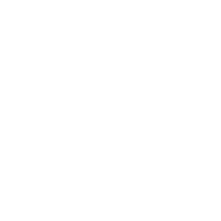

<p align="center">
  <a href="./README_EN.md">
    
  </a>
</p>

<div align="center" style="background-color: #d90429; padding: 20px; border-radius: 0px; width: full; margin: 0 auto;">
  
</div>

<br/>

# Client Service

Microservicio encargado de la gestión de personas y clientes. Utiliza **Spring WebFlux** para ofrecer una interfaz reactiva y no bloqueante.

## 🚀 Inicio Rápido

### Requisitos
- **Java 17**
- **PostgreSQL** y **Kafka** activos (puedes usar el `docker-compose.yml` de la raíz para levantar solo las dependencias).

### Ejecución Local
Desde la raíz del proyecto:
```bash
./gradlew :client-service:bootRun
```

### Docker
```bash
docker build -t client-service -f client-service/Dockerfile .
docker run -p 8081:8081 client-service
```

## 📡 Información del Servicio
- **Puerto:** 8081
- **Base Path:** `/api/clients`
- **Swagger UI:** [http://localhost:8081/api/swagger-ui.html](http://localhost:8081/api/swagger-ui.html)

## 🛠️ Tecnologías
- Spring Boot 3.4.0
- Spring WebFlux
- JPA + Hibernate (Scheduler Reactivo)
- Kafka Producer (Eventos de cliente)
- Bean Validation (Validación de DTOs)

---

## 👥 Autor

<div align="center">
  
  <br />
  <strong>Luis Arcángel Farro Terán (LAFT)</strong>
  <br />
  <a href="https://github.com/laft17s">@laft17s</a>
</div>

---
License: UNLICENSED
